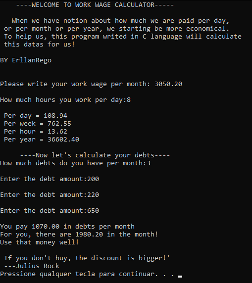
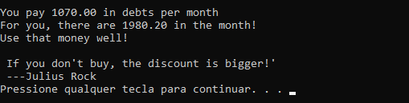

<h1 align="center">Work Wage Calculator</h1>
<h2 align="center">DEPLOY <a href="https://replit.com/@ErllanRego/Deploy#main.c">AQUI</a></h2>

"If you don't buy, the discount is bigger!"

   <a href="#objetivos">Objetivo</a> •
   <a href="#requisitos">Requisitos</a> •
   <a href="#tecnologias">Tecnologias</a> • 
   <a href="#comousar">Como usar</a> •
   <a href="#autor">Autor do projeto</a> • 
   <a href="#licenca">Licença</a>

<h3 id="objetivos">Objetivos</h3>
<ul>
 <li>
  <h4>Fazer uso da linguagem C e de cálculos matemáticos básicos</h4>
  
Apesar de ser uma estrutura de código básica, está muito bem indentada para a compreensão de
  terceiros. Além disso, foi aplicado conceitos de matemática para calcular o salário recebido por dia, semana e etc.

 </li>
 
 <li>
  <h4>Aprender a construir tecnologias que possam ser utilizados por outras pessoas</h4>
 
É costume de início efetuar projetos somente com intenção de estudo. Enquanto fazia este projeto, tentei ao máximo 
 tornar algo realmente utilizável.

 </li>
</ul>

<h3 id="requisitos">Requisitos</h3>

 Basta clonar o repositório e abrir o arquivo "WorkWage Calculator" executável.

    
<h3 id="tecnologias">Tecnologias</h3>

<h3 id="comousar">Como usar</h3>

 

 De início, é solicitado que você insira seu salário por mês, utilizando o ponto para separar as casas decimais.
   Após fazer as divisões, o programa lhe diz o quanto você ganha por dia, semana, ano e hora.
   Em seguida ele lhe pedirá para inserir quantas dividas você tem por mês( exemplo: Conta de água, luz, e aluguel = 3). Adiante, inserindo o valor de cada dívida o programa irá efetuar a subtração com base no seu salário.

   
 
   

   A frase logo abaixo do resultado varia, para o caso de sobrar apenas zero ou der um valor negativo. Neste caso essa mensagem apareceu pois o valor foi acima de zero.
   

<h3 id="autor">Autor do projeto</h3>
<table>
  <tr> 
   <td>
    
<strong><a href="https://github.com/ErllanRego">Erllan Rego</a></strong>

    

   </td>
   <td>

I'm a student of programming. At the moment I have the goal of getting an internship.

<code>🎓Technology in systems analysis and development <strong>(3º Semester)</strong></code>

 
<h3>📚Languages and Tools:</h3>   

  
  

  
  
  
  
  
  <!---->
  
 

 

 <h3>You can find me in:</h3>
 
 
  

</td>
 </tr>
</table>

<h3 id="licenca">Licença</h3>

Este projeto está sob a licença do <a href="https://github.com/ErllanRego/DropZone-Technology/blob/main/LICENSE">MIT.</a>

Feito por um aluno da <a href="https://www.uninove.br/">Universidade Nove de Julho.</a>
